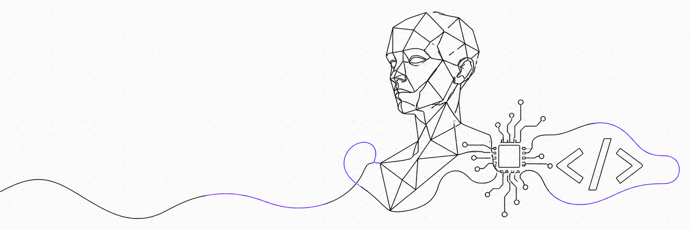

# Hi, I'm Suraj 👋

### Software Engineer · Angular & Systems Programming · AI/3D Web

I build production frontend architecture and backend microservices for a living, and chase weirder ideas — AI VTubers, OCR pipelines, architecture-design tools, the occasional rage-game — on my own time. I'd rather build something from scratch than reach for a library, just to understand how it actually works underneath.

- 🏗️ Currently building **[ProjectArch](https://github.com/surajkushvaha)** — an AI-assisted architectural design platform for the Indian market (map → zoning analysis → AI-generated 2D/3D output)
- 🤖 Also building **[Jessica](https://github.com/thanksforfree/jessica)** — an autonomous AI VTuber with a real-time 3D VRM avatar, Gemini-driven persona, and live YouTube chat integration
- 🦀 Currently learning **Rust** for systems-level and performance-oriented programming
- 📦 Maintain **[colored-beautiful-logger](https://github.com/surajkushvaha/colored-beautiful-logger)**, a published npm logging package
- 💬 Ask me about Angular architecture, web accessibility (WCAG), or PDF/OCR pipelines

 

## Tech Stack

 

## Featured Projects

| Project | What it is |
|---|---|
| 🏗️ **ProjectArch** *(private)* | AI-powered architectural design platform — map-based land drawing → zoning/DCR compliance → AI-generated 2D layouts → 3D rendering |
| 🤖 **[Jessica](https://github.com/thanksforfree/jessica)** | Autonomous AI VTuber — real-time VRM avatar, Gemini-driven persona, live YouTube chat & donation reactions |
| 📄 **[projectK](https://github.com/surajkushvaha/projectK)** | Document management & viewer platform — Angular + NestJS + PDFTron WebViewer, role-based access control |
| 🛒 **[ecommerce-backend](https://github.com/surajkushvaha/ecommerce-backend)** | Modular NestJS e-commerce API — auth, cart, orders, payments, Prisma ORM |
| 🔍 **[ocr_microservice](https://github.com/surajkushvaha/ocr_microservice)** | FastAPI + PaddleOCR document intelligence service with async Celery/Redis processing |
| 🪵 **[colored-beautiful-logger](https://github.com/surajkushvaha/colored-beautiful-logger)** | Published TypeScript logging library — log levels, file rotation, custom colored output |
| 🎮 **[Dharmshankara](https://theworstgamecompany.itch.io/dharmshankara)** | A published 2D parody/rage-game, packaged with Tauri for Web, Windows & Android |

 

## GitHub Stats

  
  

 

## Connect

